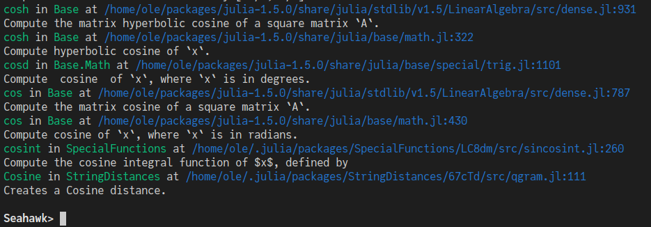

# Seahawk

[](https://Wikunia.github.io/Seahawk.jl/stable)
[](https://Wikunia.github.io/Seahawk.jl/dev)
[](https://github.com/Wikunia/Seahawk.jl/actions)
[](https://codecov.io/gh/Wikunia/Seahawk.jl)

Seahawk makes it simpler to search through Julia docstrings.

It's currently mostly built with [ReplMaker.jl](https://github.com/MasonProtter/ReplMaker.jl) and [DocSeeker.jl](https://github.com/JunoLab/DocSeeker.jl).

It provides the REPL search menu which can be entered with `/`. 

Then you type in your search query (normally a single word) to get something like this:



In this case I called it with `/ cosine`.
The results are in ascending order by the score given via DocSeeker. 

Therefore the best result is located at the bottom.

## Installation

This package is currently not registered.
It's still pretty easy to install:
```
] add https://github.com/Wikunia/Seahawk.jl
```

## Current features

Currently it's possible to use it in a similar fashion as `apropos` but have it ordered by score thanks to DocSeeker.

It also shows the first part of the docstring to get a better feeling whether that is the method you're looking for.

Additionally when running inside VSCode one can click on the file path to jump to the docstring.

## Future

I want to use TerminalMenus to have the ability to open the full docstring.

It would be awesome to search through all docs of the installed packages instead of just the loaded ones. This is already possible via DocSeeker but I'm thinking about how to best integrate it into the REPL mode i.e `in:all cosine` or something like that.

## Thanks to
- randmstring who helped a lot via my stream about this project
- Sebastian Pfitzner who made me aware of DocSeeker
